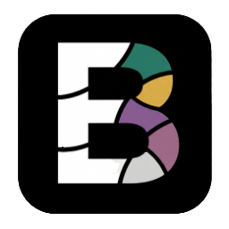
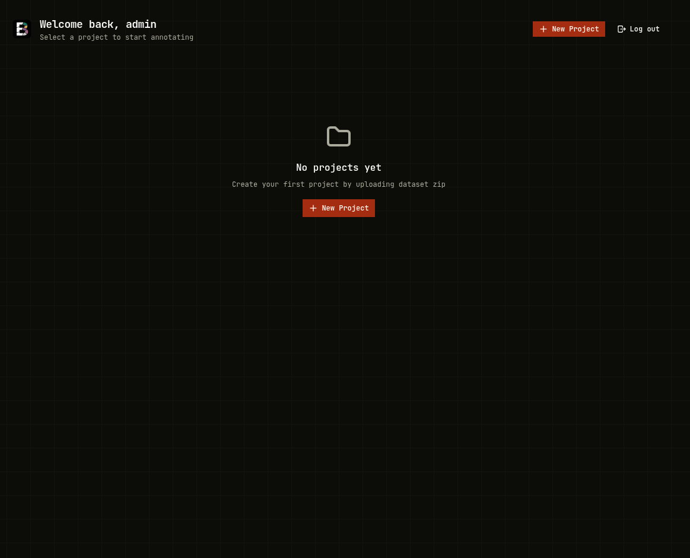
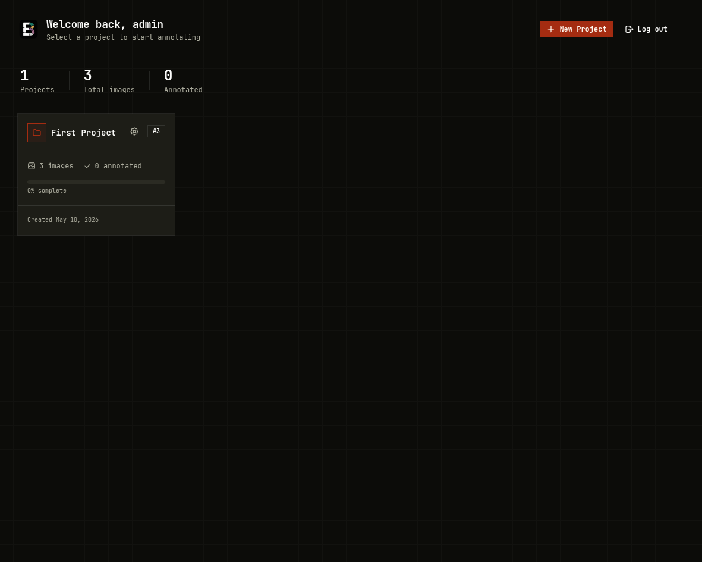
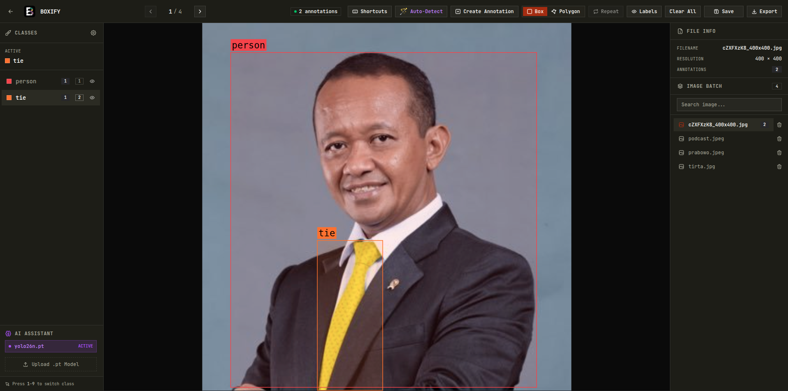
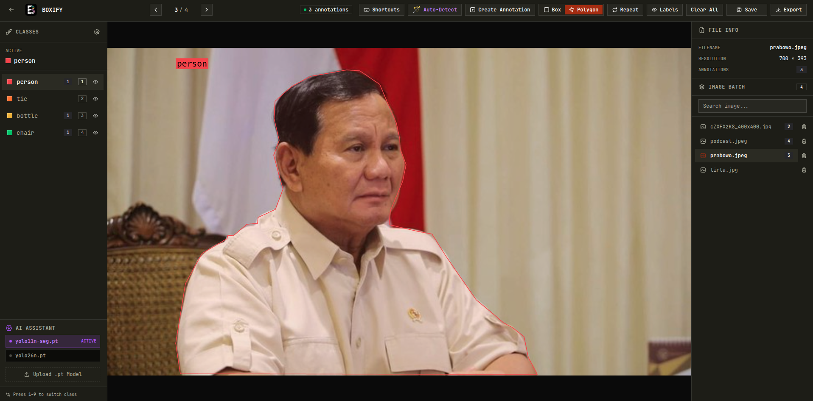

<h1 align="center">Boxify</h1>

<strong>Local Annotation Tool</strong>

  

<h2>🚀 Overview</h2>

<h3>What is Boxify?</h3>

Boxify is a local annotation tool designed to help data annotators label image datasets efficiently.
It is built for users who want a standard annotation workflow that runs offline and supports custom AI models.

<ul>
  <li>Runs fully locally</li>
  <li>Supports custom-trained models</li>
  <li>Speeds up annotation with automation</li>
  <li>Tes your models directly in your computer</li>
</ul>

<h2>✅ Key Features</h2>

<h3>Core Capabilities</h3>
<ul>
  <li>Fully local (no cloud, full privacy)</li>
  <li>Custom model support (Ultralytics)</li>
  <li>Auto annotation (bbox & polygon)</li>
  <li>Team Collaboration on Local Network (Coming Soon)</li>
</ul>

<h3>Productivity</h3>
<ul>
  <li>Fast setup (~10 minutes)</li>
  <li>Smart polygon tools (snapping & refinement)</li>
  <li>Repeat annotation support</li>
</ul>

<h3>Compatibility</h3>
<ul>
  <li>YOLO & Pascal VOC export</li>
  <li>Supports Detection & Segmentation</li>
</ul>

<h2>⚙️ Installation</h2>
<h3>Tkinter and Python must match in version.</h3>
<h4>Linux</h4>
<pre>
Run: Install Boxify Linux
</pre>

Launch by double-clicking the Boxify icon.

<h4>Windows</h4>
<pre>
Run: Install Boxify Windows
</pre>

After installation, double-click the Boxify icon.

<h2>🖥️ Interface</h2>

  

  

  

  

<h2>🤝 Contributing</h2>

<h3>How to Contribute</h3>

I am very open to anyone who wants to help make Boxify better! To keep the codebase organized and stable, I follow a standard branch-based workflow. Please follow these steps to contribute:

<ol>
  <li><strong>Fork the Repository:</strong> Click the <code>Fork</code> button at the top right of this page to create a copy of the project in your own GitHub account.</li>
  <li><strong>Clone the Project:</strong> Download the code from your forked repository to your local machine.
    <pre>git clone https://github.com/BoxifyAnnotationTools/Boxify-Web.git</pre>
  </li>
  <li><strong>Create a New Branch:</strong> Avoid making changes directly to the <code>main</code> branch. Create a sub-branch for your feature or bug fix.
    <pre>git checkout -b feature/your-feature-name</pre>
    <em>Example: <code>git checkout -b feature/dark-mode-support</code> or <code>fix/zoom-issue</code></em>
  </li>
  <li><strong>Commit Your Changes:</strong> Save your progress with a clear and descriptive commit message.
    <pre>git commit -m "Add: support for Dark Mode interface"</pre>
  </li>
  <li><strong>Push to GitHub:</strong> Upload your new branch to your forked repository.
    <pre>git push origin feature/your-feature-name</pre>
  </li>
  <li><strong>Create a Pull Request:</strong> Go to the original Boxify repository. You will see a notification to create a <code>Pull Request</code>. Explain your changes and submit it for review.</li>
</ol>

<h3>Areas for Contribution</h3>
<ul>
  <li><strong>Code Refactoring & Optimization:</strong> Improving logic efficiency, performance, and overall code quality.</li>
  <li><strong>Feature Development:</strong> Implementing new tools, automation capabilities, or user-requested features.</li>
  <li><strong>Bug Fixes & Documentation:</strong> Resolving issues and improving the clarity of installation or usage guides.</li>
</ul>

<strong>Note:</strong> Please ensure your code is tested locally before submitting a Pull Request to maintain the stability of the core application.
